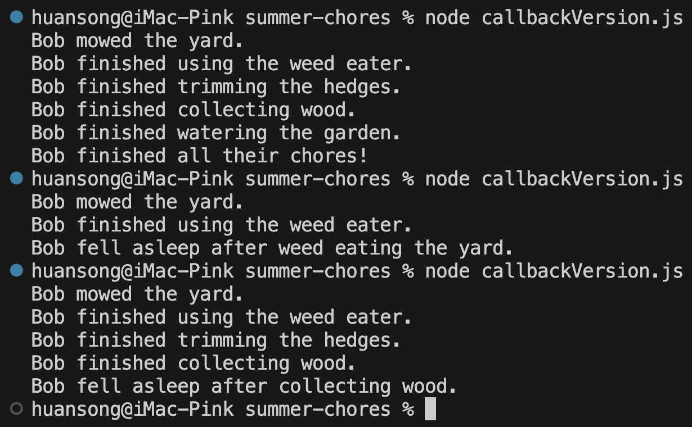
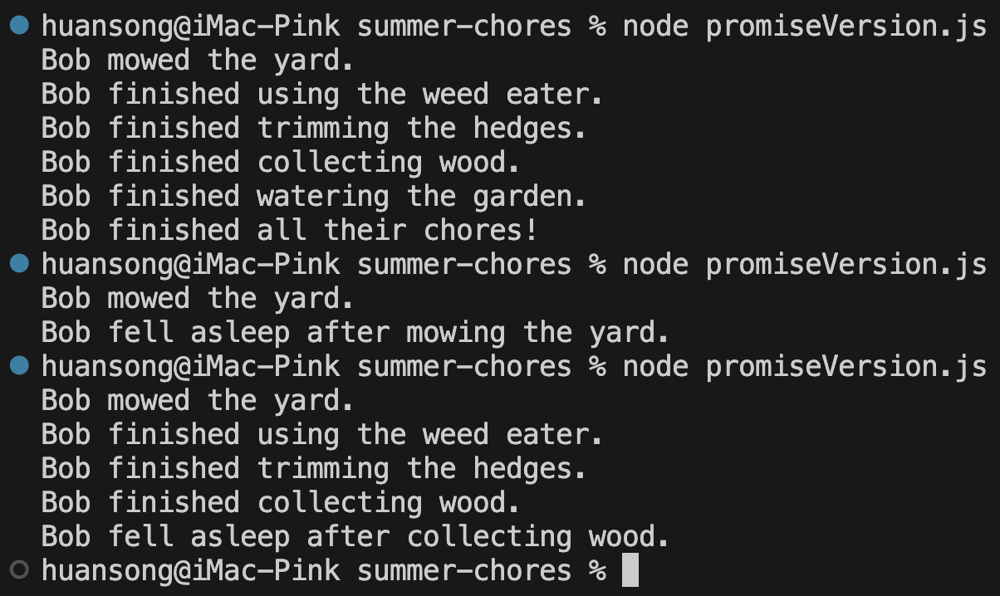

# Summer Chores

## Description

Someone has a list of summer chores they have to do every Saturday. There are a lot of chores for them to do, and naturally get more tired throughout completing their tasks. If they get too tired, they may have to take a break and go to sleep before completing their chores.

They have a strict routine, which follows in order:

1. Mow the yard  
2. Weed eat the edges of the house and fence line  
3. Trim the hedges  
4. Collect fallen wood for summer night fires  
5. Water the garden  

If they manage not to get tired and fall asleep while doing their chores, they have successfully completed their chores. Also, there's never a chance of the person falling asleep before mowing the yard.

### Time to Complete Chores

| Chore             | Time to Complete (milliseconds) |
|-------------------|:-------------------------------:|
| Mow the yard      | 2000                            |
| Weed eat the yard | 1500                            |
| Trim the hedges   | 1000                            |
| Collect wood      | 2500                            |
| Water the garden  | 500                             |

## Installation Instructions

1. Install Visual Studio Code  
2. Install Node.js  

## Usage

1. Replace the person's name on the last line of the code  
2. Run the JavaScript file in the terminal with the command:   
```bash
node filename.js
```

## Examples

Here are demos of how the code runs in the terminal:

### Callback Version



### Promise Version



## Credits

Code:You